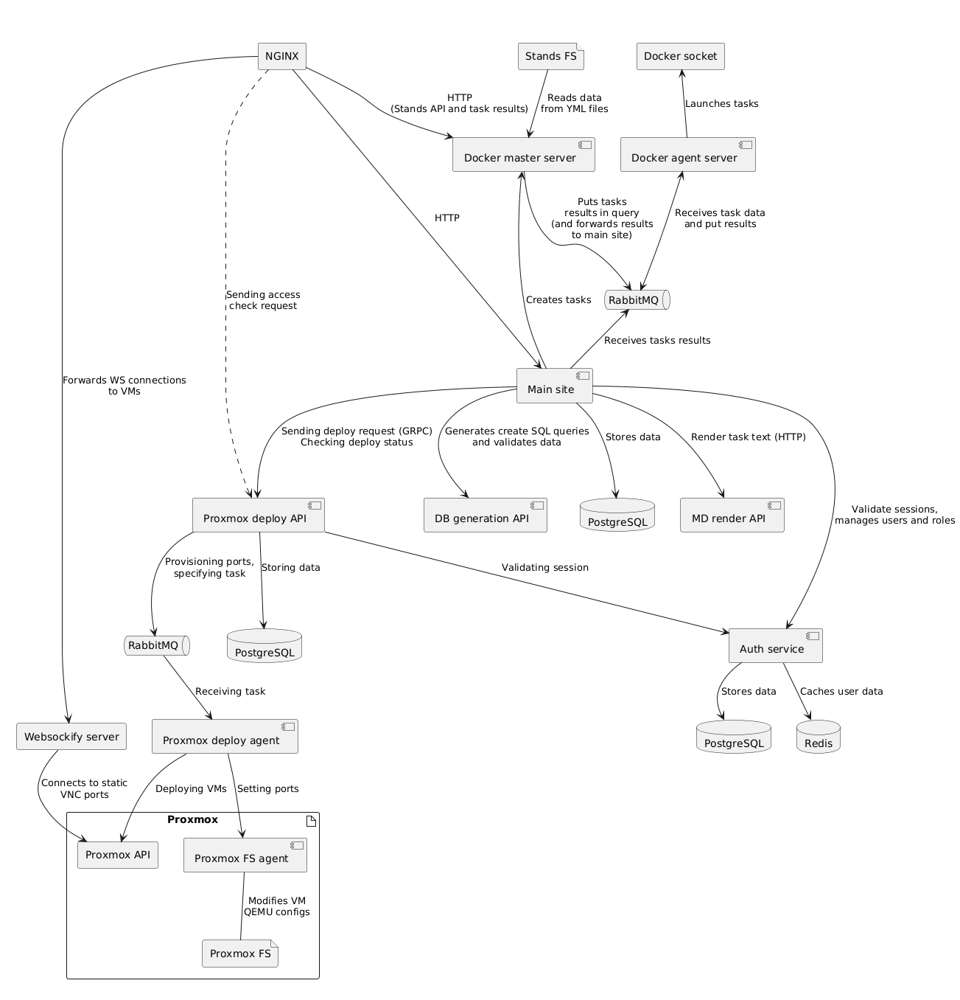

# ln2

Переизобретаем образовательную платформу. Снова.

# TODO
- [x] Создание ролей по умолчанию
- [ ] Лимит задач агента
- [ ] Очистка списка задач
- [ ] Кастомизация таймаута проверки
- [ ] Лимиты CPU и памяти
- [x] Замена публичного идентификатора пользователя с логина на ФИО
- [ ] Объединить общие сложные параметры (CORS источники, например)
- [x] Автозагрузка Docker-образов
- [ ] Добавить healthcheck'и
- [ ] Внедрить ln2-common к старым сервисам
- [ ] Оптимизировать процесс поиска DeploymentData по порту

# Схема сервисов



# Развертывание

    Система для запуска: любой дистрибутив Linux с поддержкой Docker и make

- Установить make
- Собрать образ nginx и frontend проекта
```bash
make build-nginx
```
- Собрать образ websockify
```bash
make build-websockify
```
- Собрать базовый образ для сборки сервисов на Haskell
```bash
make build-lib-image
```
- Запустить сборку образов сервисов
```bash
make build-images
```
- Скопируйте образец env-файла для запуска в Docker. Поправьте по необходимости адрес Unix-сокета Docker (строка `DOCKER_SOCKET`).
Сгенерируйте и вставьте секретный ключ для JWT аутентификации (например, при помощи команды `openssl rand -hex 32`) в поле `AUTH_JWT_SECRET`.
Укажите IP Proxmox-ноды вместо `<ip>`, впишите название ноды в поле `PROXMOX_NODE_NAME`. Создайте токен и впишите его данные в поля 
`PROXMOX_API_TOKEN_SECRET` и `PROXMOX_API_TOKEN_ID`. 

Если будет использоваться DHCP-сервер от SDN (dnsmasq), укажите наименование IPAM 
(обычно создается по умолчанию с именем `pve`) в поле `PROXMOX_INTERNET_IPAM_NAME`, поправьте необходимые данные в полях
`PROXMOX_INTERNET_NETWORK_DHCP_BEGIN` и `PROXMOX_INTERNET_NETWORK_DHCP_END`, которые определяют
начало DHCP-пула и его конец. dnsmasq может плохо функционировать, если включен Firewall, поэтому
как альтернативный вариант, требуется закомментировать строки и развернуть свою реализацию DHCP-сервера
в сети (собственный инстанс dnsmasq, VM с DHCP сервером, и.т.д)
```bash
cp docker-sample.env docker.env # скопировать образец, если не делали этого раньше
```
- Соберите и установите Proxmox-агент на используемую ноду (см. секцию ниже)
- Запустите сервисы. Миграции базы данных выполнятся автоматически.
```bash
make deploy-prod
```
- Выпустите токен, используемые для взаимодействия между сервисами и поместите его в поле `SERVICE_ACCESS_TOKEN`
```bash
docker exec ln2-prod-auth /usr/src/app/haskell-binary issue-token -s common
```
- Создайте базовые роли
```bash
docker exec ln2-prod-auth /usr/src/app/haskell-binary create-roles
```
- Создайте администратора для управления платформой
```bash
docker exec ln2-prod-auth /usr/src/app/haskell-binary create-admin --login admin [--password P@ssw0rd] [--name Administrator]
```
- Перезапустите сервисы с новым токеном. Попробуйте получить доступ к платформе по адресу `http://<ip>:8000`
```bash
make destroy-prod && make deploy-prod
docker restart ln2-prod-nginx # на всякий, иногда upstream'ы падают
```

## Установка Proxmox-агента

Поскольку подключение к VM реализуется установкой статического VNC-порта (которое до сих пор закрыто от лица root-пользователя через API),
процесс реализуется при помощи запущенного на ноде Proxmox агента. Для сборки требуется Docker с buildx и make

Для сборки потребуется файл `docker.env` в корневой директории, откуда будет взято значение `PROXMOX_AGENT_ACCESS_TOKEN`. Укажите его, после
```bash
cd proxmox-fs-agent
make build-bin-docker
```

После чего можете переместить директорию `deployment` на целевую ноду и запустить там `install.sh` с правами суперпользователя. После,
запустите сервис командой `systemctl start proxmox-fs-agent` или перезагрузите ноду. Проверьте занятость 8000 порта. Если требуется иной
сетевой порт, отредактируйте файл `proxmox-fs-agent.service`. Поправьте поле `PROXMOX_AGENT_URL`.

## Портативность сборки

Для экспорта образов, которые требуются для сборки и запуска существуют цели Makefile

```bash
# сохраняет образы как TAR-архивы в папке images
make save-build-images
make save-deploy-images
# восстанавливает образы из TAR-архивов
make restore-build-images
make restore-deploy-images
```

Для экспорта образов микросервисов есть опции `save-images` и `restore-images`

# Программные зависимости

- foreman - запуск сервисов вне Docker
